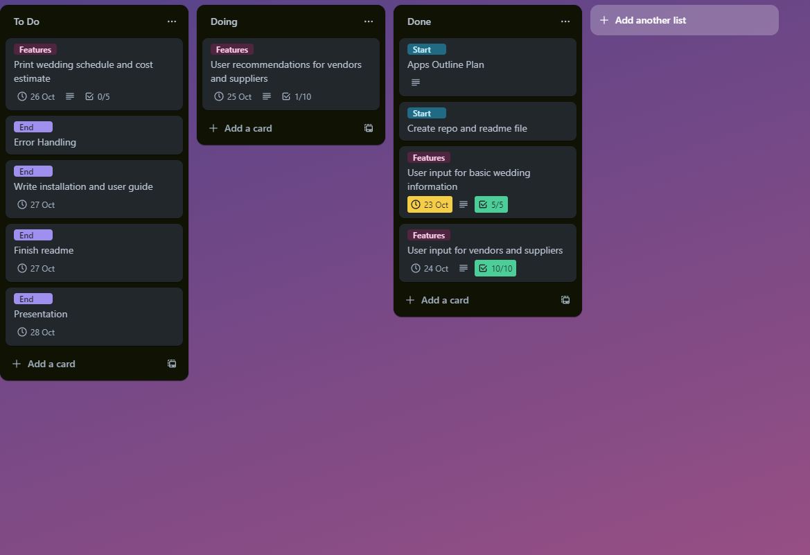
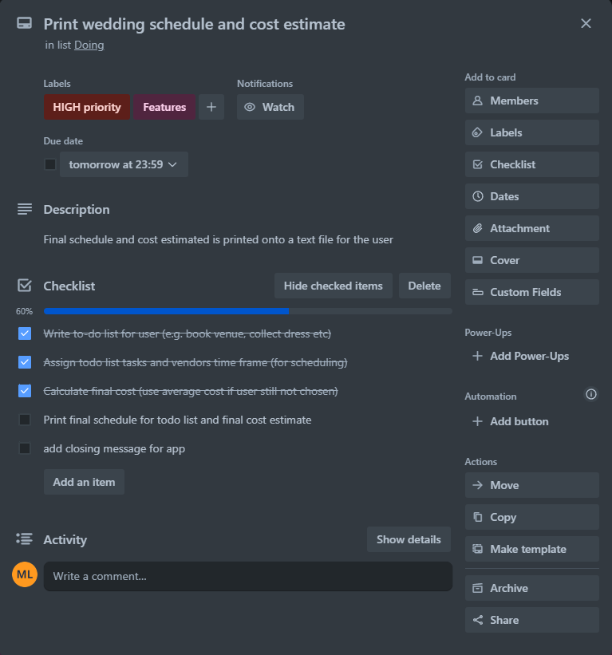
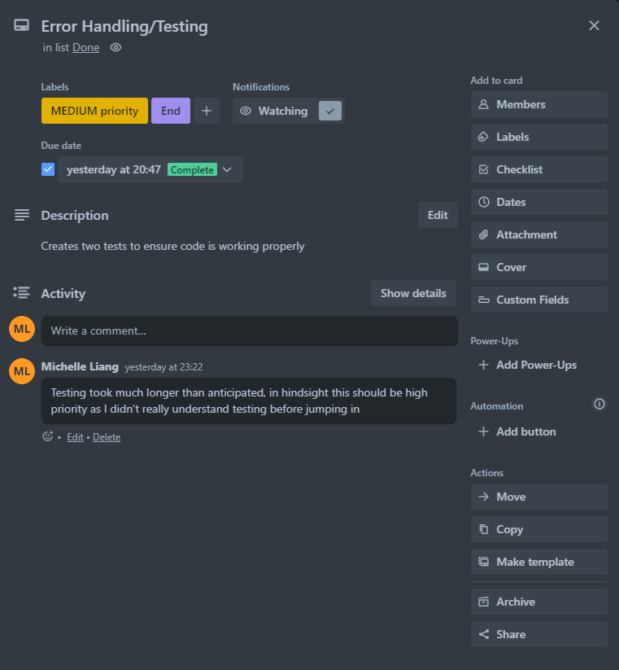

# MichelleLiang_T1A3

### Link to github: 

[Github Link](https://github.com/mcelle888/MichelleLiang_T1A3) 

### Code Style Guide: 

[Pep8 Guide Link](https://peps.python.org/pep-0008/#class-names) 

Code was written using python and following PEP8 Styling Guide linked above. Some notable styling features followed include:

1. Four line indenting 
2. Adherance to naming conventions (e.g. CapWord for classes and exceptions, lowercase and underscores forr functions and variables)
3. Self is first argument for instance methods
4. Line breaks occur before the binary operator for formulas
5. Modules all have lower case names with underscores used to improve readability in some cases
6. Inline comments avoided with block comments indented to the same level as code
7. Maximum line length of 79 characters  

### Features in the Application

#### Feature 1 : User's basic information
Allows the user to input some basic information about themselves and the wedding including their name, budget and date of wedding.


#### Feature 2: 
Goes through a list of vendors for a wedding and asks the user if they have a chosen vendor or not. If they do, they are asked to enter the name and the cost. If not, they are provided with 3 reccommendations for each vendor with their respective costs and a short description. The user can pick one of these recommendations or they can choose to have the app randomly pick out of the three or finally they can choose to leave the vendor blank (in this case, an average cost will be used to calculate the final cost estimate). 


#### Feature 3:
Creates a text file containing the users basic information, suppliers and final cost estimate. Will print whether they are under or over budget and by how much. 


### Help Documentation 


#### Hardware Requirements

#### App Installation Guide


##### 1. Open Terminal
In your terminal window, check that you have the correct version of python installed. You can do this by running:
```bash
python --version
```
If python version is not installed or you have a version below 3.10, the installation and update links can be found [here](https://www.python.org/downloads/) 

##### 2. Download Wedding App

Copy and paste the following to your terminal: 
```bash
git clone git@github.com:mcelle888/MichelleLiang_T1A3.git
```

The file can also be found from github [here](https://github.com/mcelle888/MichelleLiang_T1A3). 

##### 3. Open the application file that was cloned 
```bash
cd MichelleLiang_T1A3/src
```

##### 4. Run the following executable command to open the application 
Running the code below will:
1. Check again whether or not python is installed
2. Create and activate a virtual environment
3. Install all dependencies required for this app
4. Run the application file


```bash
bash open_app.sh
```

#### Dependencies Required:

```python
pyfiglet == 1.0.2
emoji == 2.8.0
colorama == 0.4.6
pandas == 2.1.1 
pytest == 7.4.3
```


### Implementation Plan
[Link to Trello](https://trello.com/b/Znwe2osx/terminal-app)
#### Screenshots Day 1

Start of day 1


Feature 1 


Feature 2


Feature 3


End of day 1



#### Screenshots Day 2
Feature 3


Feature 4



End of day 2


#### Screenshots Day 3
Feature 4


End of day 3


#### Screenshots Day 4

Error and Testing 



End of day 4


#### Screenshots Day 5


#### References 

